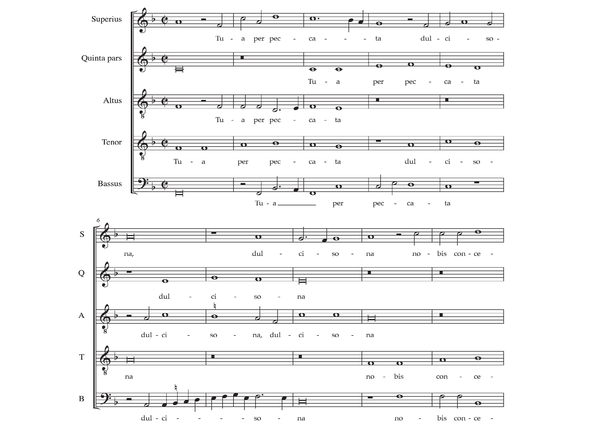

```{r setup, include=FALSE}
knitr::opts_chunk$set(echo = TRUE)
```

## Inngangur

,,Óflekkuð, heil og skírlíf ert þú, María´´. Svo hljóðar íslensk þýðing á titli latneska Maríusekvensins: *Inviolata, integra et casta es Maria*. Bæði @arni1 (hér eftir ÁHIsaga) og @arni2 (hér eftir ÁHIgripla) fjalla um þennan sekvens en hann á upphaf sitt í frönskum messusöng á 11. öld. Sekvens þessi mun hafa náð töluverðum vinsældum á endurreisnartímanum og sömdu fjölmörg tónskáld um hann tónverk. Þar á meðal var eitt frægasta tónskáld endurreisnartímabilsins Josquin Des Prez sem samdi þriggja parta mótettu við sekvensinn. Samkvæmt ÁHIsaga var *Inviolata* eitt dáðasta verk Josquins alla 16. öldina og það kemur svo sem ekki á óvart því tónverkið er einstaklega fallegur og ljúfur lofsöngur til Maríu. Áður en við höldum lengra skulum við hlýða á lokakafla mótettunnar í hugljúfri útsetningu fyrir kontratenór (Carlos Mena) og harmoniku (Iñaki Alberdi): 

<div style="text-align:center">
<iframe width="560" height="315" src="https://www.youtube.com/embed/oJFRbU_YsBo" frameborder="0" allowfullscreen></iframe>
</div>

## Æviágrip og tónlist Josquins des Prez

Josquin Des Prez (um 1450-1521) var eitt virtasta tónskáld fransk-flæmska skóla endurreisnartímabilsins. @arni1 (hér eftir ÁHIsaga) gerir ævi þessa tónskálds góð skil (bls. 100-106) en almenn vitneskja um ævistarf hans er þó ekki vel skráð. Hann er talinn hafa fæðst í Saint-Quentin í Frakklandi og starfaði við hirð Renés hertoga í Aix-en-Provence um 1475-80 áður en hann flutti til Ítalíu. Þar starfaði Josquin fyrir Ascanio Sforza kardinála í Mílanó og Róm og á árunum 1489-94 varð hann svo þess heiðurs aðnjótandi að syngja í kór Sixtínsku kapellunnar í Róm. Árið 1502 var hann ráðinn sem tónskáld við hirð hertogans Ercole I d'Este í Ferrara. Þá hafði hann þegar öðlast frægð og var af mörgum talinn besta tónskáld álfunnar. Það var á endanum megin ástæða þess að hertoginn kaus Josquin fram yfir tónskáldið Heinrich Isaac sem einnig kom til greina fyrir stöðuna þrátt fyrir að Josquin væri talinn dýr í rekstri og sagður semja þegar honum hentaði. Að loknu starfi sínu á Ítalíu flutti Josquin aftur til Frakklands þar sem hann starfaði við Maríukirkjuna í Condé-sur-l'Escaut til æviloka.

Ljóst er að Josquin hefur verið afburða tónskáld og með tilkomu prentlistarinnar og nótnaútgáfu öðlaðist hann frægð umfram það sem áður þekktist. Einkenni tónlistar Josquins var (oft tæknilega flóknir) hermipunktar sem ná til allra radda en á sama tíma tilfinningarík túlkun undirliggjandi texta í tónum. Enginn annar en Marteinn Lúther sagði að hann væri ,,meistari tónanna; þeir urðu að haga sér eins og hann kaus en önnur tónskáld verða að gera eins og nóturnar vilja´´ og eftir dauða hans byggðu ekki ómerkari tónskáld en Lassus og sjálfur Palestrina verk á tónsmíðum hans (ÁHIsaga). Josquin var sömuleiðis tiltölulega afkastamikið tónskáld og er talinn hafa samið um 60 mótettur. Á meðal þeirra frægustu má nefna *Ave Maria ... Virgo Serena* sem tónlistarfræðingur nokkur hefur kallað ,,Mónu Lísu endurreisnartónlistarinnar,´´ (ÁHIsaga) og *Inviolata, integra et casta es Maria* sem verður fjallað ítarlegar um hér að neðan. Sömuleiðis er vert að minnast á mótettuna *Nymphes des bois* en Josquin samdi hana við tregróf Jean Molinet, ort eftir andlát tónskáldsins Ockeghems sem líklega hefur verið áhrifavaldur í lífi Josquins (ÁHIsaga). Að lokum má nefna önnur tónverk sem vert er að hlusta á eins og *Missa pange lingua*, *Missa L'homme armé super voces musicales* og *Mille regretz*.


## Inviolata, integra et casta es Maria

### Textinn

Á Konunglega bókasafninu í Stokkhólmi má finna tvö handritsbrot sem innihalda íslenska þýðingu textans við *Inviolata* og eru þau talin vera frá því um árið 1550 (ÁHIb). Það er einmitt árið sem Jón Arason síðasti kaþólski biskupinn á Íslandi var hálshöggvinn sem væri svo sem ekki í frásögur færandi nema fyrir þær sakir að íslenski textinn sem um ræðir ber þess skýr merki að vera lúthersk útfærsla á kaþólskum lofsöng til Maríu. Hér fyrir neðan sjáum við þrjár útgáfur textans. Sú til vinstri er latneska frumgerðin og sú í miðjunni er umrædd íslensk þýðing en báðar er þær að finna í ÁHIb. Textinn lengst til hægri er svo loks tilraun til leiðréttrar þýðingar og er eftir höfund þessarar ritgerðar. Styðst hún að mörgu leyti við upprunalegu þýðinguna sem og við athugasemdir í ÁHIb. Þýðing lokaákallsins til Maríu sem vantar í upprunalegu þýðinguna er tekið beint upp úr ÁHIa.

:::: {style="display: flex;"}

::: {}
Inviolata, integra et casta es Maria,  
<span style="color: white;">.</span>  
quae es effecta fulgida caeli porta.  
O Mater alma Christi carissima,  
suscipe pia laudum praeconia.  
Te nunc flagitant devota corda et ora,  
nostra ut pura pectora sint et corpora.  
Tua per precata dulcisona,  
nobis concedas veniam per saecula.  
O benigna!  
O Regina!  
O Maria!  
quae sola inviolata permansisti.  
:::

::: {}
$~$ $~$ $~$ $~$ $~$ $~$ $~$ $~$ $~$
:::

::: {}
Ad obrugnum oskiertum og skiærum  
meydom <span style="color: red;">fæddi sinn son maria</span>.  
Hvor ad ert ordin himna <span style="color: red;">kongsins herberge</span>.  
Og moder Jesu kristi kiærasta.  
Medtaki <span style="color: red;">hann</span> allra truadra bæner.  
Hvoriar vier fram flytium af hiarta og munni.  
Ad vor hiortu og lykamer [hreiner] verde.  
Gief þu vier þig um bidium  
Veit þu oss nad um allar alldir allda.  
<span style="color: red;">O þu gode  
O þu millde  
O Jesu kærste  
Hvor ad fyrir oss fædast [villder]</span>.  
:::

::: {}
$~$ $~$ $~$ $~$ $~$ $~$ $~$ $~$ $~$
:::

::: {}
Óflekkuð, heil og skírlíf ert þú, María,  
<span style="color: white;">.</span>  
sem ert orðin skínandi himnahlið.  
Ó, kæra nærandi móðir Krists,  
Meðtakið þér allra trúaðra bænir.  
Þig vér biðjum með hjarta og munni,  
að vor hjörtu og líkamar megi hrein verða.  
Með þínum bænum ómblíðum,  
veit þú oss náð um aldir alda.  
Ó, blessuð!   
Ó, drottning!  
Ó, María!  
sem ein ert óflekkuð enn.  
:::

::::

Með rauðu er merkt við markverðugustu lúthersku útfærslurnar í íslensku þýðingunni frá um 1550. ÁHIb dregur þetta ágætlega saman þegar hann segir að ávörp til Maríu áttu ,,lítinn hljómgrunn í guðfræði Lúthers og eins og oft vill verða í Maríukveðskap eftir siðaskipti er hluta textans hér snúið upp á Krist´´. Í réttari þýðingu textans lengst til hægri afhjúpast aftur á móti upprunalegur ásetningur textahöfundar, þ.e.a.s. ljúfur lofsöngur til Maríu. Að frátöldum þessum augljósu breytingum á textanum er upprunalega þýðingin að mörgu leyti nokkuð góð þó hún sé ekki alltaf bókstaflega rétt. Vert er að leggja áherslu á íslenskun orðanna: ,,Tua per precata dulcisona´´ en í upprunalegu þýðingunni er gengið fram hjá þeirri staðreynd að latenska orðið dulcisona merkir bókstaflega að hljóma ljúft eða vera ómblíð. Í mótettu Josquins við textann er mikilvægt að halda til haga þessum blæbrigðamun á þýðingunni og munum við koma aftur að þessum punkti hér á eftir.

### Tónlistin

Mótetta Josquins við *Inviolata* er fimm radda verk byggt á gregorskum sekvens. Tvær raddanna syngja sléttsönginn í keðju á meðan hinar þrjár syngja frjálsan kontrapunkt (ÁHIsaga). Mótettan er í þremur hlutum. Í þeim fyrsta líða 3 taktar á milli endurtekningar sléttusöngsins, á meðan í öðrum hlutanum líða tveir taktar þar á milli og loks aðeins einn taktur í þriðja og síðasta hlutanum. Hér var því augljóslega um þaulhugsað tæknilegt afrek í tónsmíðum að ræða eða eins og ÁHIsaga orðar það: ,,Keðjusöngurinn er eins konar eltingaleikur í tónum og forskot tenórsins minnkar eftir því sem líður á verkið.´´  @owen gerir *Inviolata* að rannsóknarefni sínu og gefur einstaklega skemmtilega greiningu á uppbyggingu tónsmíðarinnar. Hér verður fjallað lauslega um aðalinntak greiningarinnar og tóndæmi skoðað því til stuðnings.  

Á tímum Josquins var nótnasetning tónlistar ekki jafn nákvæm og afgerandi eins og nú til dags. Formerki og úrfellingarmerki voru ekki endilega samviskusamlega skrifuð niður og söngvarar gátu ekki lesið allar raddir lagsins í einu til að átta sig á innra samhengi þeirra á milli. Söngvarar þess tíma urðu því að túlka forskrift sinnar raddar eftir bestu getu en á sama tíma að fylgja ákveðnum grunnreglum um eðlilega framvindu laglínunnar. Til að mynda var mikilvægt að forðast ákveðin tónbil eins og hækkaða ferund (tónskratta) eftir bestu getu. Í ljósi ófullkomnar nótnasetningar þess tíma var aftur á móti óhjákvæmilegt að slíkir tónskrattar spryttu fram þegar raddirnar hljómuðu saman. @owen lýsir því hvernig þetta var í raun og veru algengt og að þegar slíkir tónskrattar komu fram í fyrsta skipti sem lagið var sungið í kór þá hefðu söngvar þurft ræða málin sín á milli og bregðast við með því að setja for- eða úrfellingarmerki á viðeigandi nótu. Nótan B hafði til að mynda þessa sérstöðu á tímum Josquins og gátu söngvarar því átt von á því að þurfa syngja B annað hvort eins og það var skrifað eða sem H (B með úrfellingu), allt eftir tónlistarlegu samhengi. @owen vitnar í tónfræðinginn Pietro Aaron (um 1485-1545) þessu til stuðnings sem á að hafa sagt (upprunaleg ensk þýðing kemur frá @Bent): ,,Now it will be considered whether the singer should or indeed recognize at the first attempt the intent and secret of a composer, when singing a song he has not seen be before. The answer is no ... For this reason I say that those who do not indicate the sign of b molle where it might naturally appear to be otherwise, commit no little error, because an intention retained in the mind accomplishes nothing.´´ Af þessari samtímaheimild að dæma er ljóst að áðurgreindar óvæntu uppákomur á söngæfingum hlutu að vera víðtæk venja. Í greiningu @owen á *Inviolata* hans Josquins kemur fram að þegar raddirnar eru skoðaðar hlið við hlið þá megi færa rök fyrir því að viðlíka uppákomur hljóti að hafi átt sér stað á nokkrum stöðum. Hann gengur meira að segja svo langt að segja að á a.m.k. einum stað í sekvensinum hljóti Josquin hreinlega að hafa beinlínis verið að gera söngvurunum grikk. Við skulum nú skoða þennan stað í mótettunni betur og setja hann í samhengi við merkingu textans sem við ræddum um hér á undan.

```{r, echo=FALSE, fig.align='center', fig.cap='Dæmi 1: Úr mótettunni Inviolata eftir Josquin Des Prez.'}

```
Dæmi 1 er fengið beint upp úr @owen og sýnir takta 85-94 sem eru að finna undir lok annars hluta mótettunnar. Eins og áhersla var lögð á er við ræddum merkingu latneska textans þá mætti þýða orðið dolcisona sem ómblíð. @owen telur að nákvæmlega þetta orð hafi veitt Josquin innblástur til að leggja gildru fyrir söngvara alt raddarinnar. Gildran er sett í fjórða og fimmta takti tóndæmisins þegar tenórinn syngur orðið dulcisona innan laglínu sléttusöngsins sem inniheldur tóninn B. Laglínuna (með B) hefur altinn trúlega þekkt vel og byrjar hann því grandalaus í sjötta takti að syngja sömu upphafstóna og tenórinn var að enda við að syngja. @owen telur næsta víst að altinn hafi eðlilega sungið B við fyrsta æfingaflutning mótettunnar. Það aftur á móti hefði framkallað stækkaða ferund með bassaröddinni og því líklegt að fyrsti flutningur þessa orðs hafi verið allt annað en ómblíður. Í dæminu setur @owen úrfellingarmerki yfir B-ið og í síðari útgáfum af verkinu hefur tóntegundinni einfaldlega verið breytt á völdum stöðum í verkinu til þess að ómblíð fimmund hljómi í stað tónskrattans.

## Lokaorð

Hver svo sem ásetningur Josquins var við gerð mótettunnar *Inviolata* þá er ljóst að útkoman (eftir aðlaganir og úrfellingarmerki) var einfaldlega stórkostleg. Mótettan er tæknilega  margslungin samanber eltingaleik keðjusöngsins og á sama tíma svo hugljúf og falleg. Við greiningu tónlistar og texta tónskáldsins er ljóst að töluverða vinna hefur farið í að túlka textann með viðeigandi blæbrigðum í tónum (eða gera söngvurum verka sinna grikk). Þetta er áminning um mikilvægi þess að leggja metnað í að þýða undirliggjandi latneska texta rétt, því tónlist Josquins var samin beinlínis með það að markmiði að túlka orð undirliggjandi texta. Við ljúkum umfjölluninni hér á því að hlýða á mótettuna í heild sinni. Í myndbandinu hér fyrir neðan heyrum við flutning fimm radda kórs sem kallar sig Stile Antico. [Hér](https://josquin.stanford.edu/cgi-bin/jrp?a=notationWithEditWithText&f=Jos2404) má svo finna nótur til að lesa með úr útgáfu Josquin-rannsóknarverkfnisins í Stanford háskóla. Vert er að fylgjast með keðjusöng tenóranna tveggja og fylgjast með ómblíðum hljóminum sem heyrist undir latnesku orðunum dolcisona.

<div style="text-align:center">
<iframe width="560" height="315" src="https://www.youtube.com/embed/3hGgBC7aNso" frameborder="0" allowfullscreen></iframe>
</div>

## Heimildaskrá